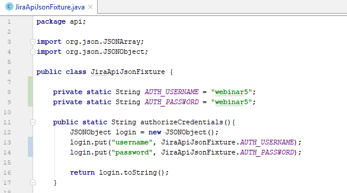

# POJO API Sample #

This project contains simple API tests which shows how to use POJOs. 

*SampleTest.java* - tests uses POJO classes

*DecompositionTests.java* - demonstrates decomposition principles.
 Methods for generating JSON objects, sending GET, POST, PUT, DELETE were placed in separate classes.
 
 
 ###How to run Test###
 To run test from Intellij Idea
 1. Clone repository
 2. Import source code as Maven project
 3. Update src/main/java/api/JiraApiJsonFixture.java with your credentials

 4. Add TestNG Run configuration
 
 
 ###Class description###
 *Authorization.java* - used for login, get JSESSIONID
 
 *HttpRequestSender.java* - sends GET, POST, PUT, DELETE requests
 
 *JiraApiActions.java* - contains functional methods: 
 - *createIssue()*
 - *addComment()*
 - *deleteIssue()*
 - ...
 
 *JiraApiJsonFixture.java* - generates JSON string
 *JiraApiParameters.java* - contains API pathes, base URL...
 
  
 ###Libraries###
 1. TestNG
 2. Rest-Assured
 3. Log4j
 4. Json